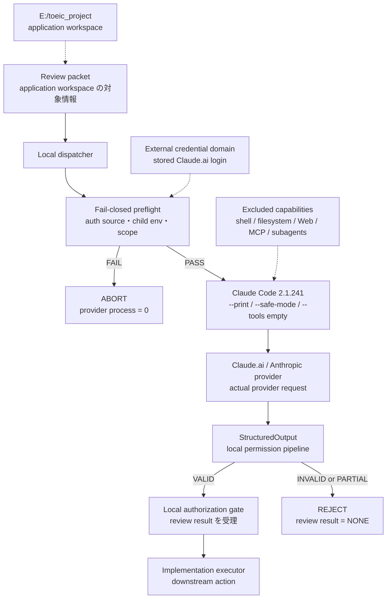

# Claude Code Review-Only Executor の実証統合

## OAuth／Credential Boundary／Fail-Closed 設計を production path の実証まで追う

| 項目 | 内容 |
| --- | --- |
| 文書種別 | Portfolio / Engineering Report |
| ポートフォリオ版作成日 | 2026-08-30 |
| Evidence snapshot | 2026-08-24 |
| 対象環境 | Windows / Claude Code `2.1.241` / `claude-opus-5` |
| 認証契約 | Claude.ai stored login / Claude Pro subscription |
| 最終判定 | `G4_AUTH_SUBGATE = PASS`、`G4_OUTPUT_SUBGATE = BLOCKED_PERMISSION_CONTRACT` |
| 原資料 | `E:\toeic_project\docs\CLAUDE_CODE_REVIEWER_INTEGRATION_CASE_STUDY_JA.md` |

> この文書は、長大な実証記録をポートフォリオ／技術報告書向けに再編集したキュレーション版である。認証資格情報、ユーザーSID、端末名、support ID、request identifier は掲載しない。本文の PASS は、記載したバージョン、実行経路、測定条件にのみ適用され、運用上の正本や security specification を置き換えない。

## 用語・スコープの位置づけ

本稿の **G4** は、第4段階の結合検証ゲートを指す。auth source、実 provider 到達、reviewer isolation、structured output contract を個別の subgate として検証し、すべてが成立して初めて G4 全体を PASS とする。

**G5** は、G4 通過後に review-only reviewer path を downstream の production orchestration へ進める次段階の検証ゲートである。本稿の evidence snapshot では G4 の output contract が未成立のため、G5 には進んでいない。

| 用語 | 本稿での意味 | 現在の状態 |
| --- | --- | --- |
| G4 auth subgate | credential、auth source、実 provider 認証の結合検証 | PASS |
| G4 output subgate | StructuredOutput、process、parse、final schema の検証 | BLOCKED |
| G4 certification | auth と output を含む結合検証全体 | NOT READY |
| G5 | G4 後の downstream production orchestration 検証 | 未着手 |

## 開発目的と対象プロダクト

この統合の目的は、Claude CLI を呼び出すことそのものではない。`E:\toeic_project` の学習アプリに対して、Claude Pro subscription を利用した自動レビューを導入しつつ、application workspace、credential、provider request、review decision の権限境界を分離することである。API key への従量課金 fallback、credential の workspace 混在、reviewer からの shell／filesystem／MCP 到達、partial output の誤採用を許容しない。

ここでいう local orchestration は「推論を完全オフライン化した」という意味ではない。dispatcher、credential domain、preflight、lock、結果検証をローカルで制御し、provider への実リクエストは外部サービスへ到達する。この区別を明記することで、ローカル制御とオフライン推論を混同しない。

対象コードベースは TOEIC L&R の問題生成、回答、採点、復習を扱う学習アプリである。作業時点の targeted inventory では、production source は46ファイル（Python 44、JavaScript 1、HTML 1）、tests は38ファイル（Python 36と補助ファイル）で構成される。Claude Code はこのアプリを直接変更する実装者ではなく、**review-only executor** として位置付ける。

## エグゼクティブサマリー

初期構成では、local auth status は `loggedIn = true`、`authMethod = oauth_token`、`apiProvider = firstParty` を返したにもかかわらず、実 provider request は `HTTP 401 / Invalid bearer token` で失敗した。ここで「ログイン済み」と「provider が認証を受け付けた」を別の acceptance axis に分けたことが、後続設計の出発点になった。

認証方式は、OAuth token の自前管理や従量課金 fallback ではなく、Claude Code 自身の通常 Claude.ai login lifecycle を、application workspace 外の専用 credential domain で利用する形へ変更した。さらに、`AuthSourcePin`、credential lock、fail-closed preflight、partial response rejection を組み合わせ、認証・provider・output contract・local permission を分離して判定した。

最終的に stored login から実 provider への到達と credential isolation は成立した。一方、Claude Code `2.1.241` の内部 `StructuredOutput` が `--permission-mode dontAsk` 下の local permission handler に拒否され、G4 全体は未完了となった。`bypassPermissions` や tool 権限拡大で無理に通すのではなく、**認証は PASS、出力契約は BLOCKED、G4 は未通過**と記録して upstream clarification 待ちにした。

| 評価軸 | 判定 | 意味 |
| --- | --- | --- |
| Stored Claude.ai login | PASS | isolated credential domain から local auth を確立 |
| 実 provider authentication | PASS | provider request 到達、401 regression なし |
| Credential isolation | PASS | workspace 外配置、ACL hardening、内容非読取 |
| Reviewer isolation | PASS | ordinary tools / MCP / subagents = 0 |
| Production auth wiring | PASS | 旧 OAuth token の child 注入を除去 |
| StructuredOutput contract | BLOCKED | `dontAsk` との supported permission contract 未確定 |
| G4 certification | NOT READY | auth subgate の PASS を全体 PASS に昇格させない |

## 1. 目標アーキテクチャ

Claude Code の責務を review-only に限定し、provider request の前に認証源と実行環境を検証する。review result が完全な output contract を満たした場合だけ、下流の local authorization gate が利用できる。



この図の重要な点は、provider request が成功しても、StructuredOutput や final output contract が失敗すれば review result を成立させないことである。また、認証 preflight が不一致を検出した場合は、別 credential を試すのではなく provider process 起動前に停止する。

### 1.1 Reviewer の固定プロファイル

```text
Model                = claude-opus-5
Built-in tools       = 0
MCP                  = 0
Subagents            = 0
Auto memory          = disabled
Session persistence  = disabled
Session resume       = disabled
Provider retry       = disabled
Auth fallback        = disabled
```

CLI の構成も、headless review を最小権限で実行する方向に固定した。

```text
--print
--safe-mode
--tools ""
--setting-sources ""
--no-session-persistence
--output-format stream-json
--verbose
--json-schema <schema>
```

`--tools ""` は ordinary visible tools をゼロにするための設定であり、内部 `StructuredOutput` の permission contract が自動的に解決されることを意味しない。ここを同じものとして扱わなかった。

### 1.2 コンポーネントの役割分担

| Component | 役割 | 担当しないこと |
| --- | --- | --- |
| Local dispatcher | review packet の受付、preflight、child process lifecycle、結果分類 | provider の認証契約を独自に再実装すること |
| External credential domain | stored Claude.ai login の保存領域 | application source、Git root、通常ユーザーの `.claude` との共有 |
| `AuthSourcePin` | config domain、auth status、provider、競合 credential の一意性を検証 | credential file の内容を解析すること |
| `CREDENTIAL_LOCK` | auth status から provider result classification まで shared credential state を直列化 | 認証そのもの、permission の緩和 |
| Claude Code `2.1.241` | headless client、provider transport、structured output 呼び出し | 下流の review authority を単独で決めること |
| `claude-opus-5` | reviewer inference | shell、filesystem、Web、MCP、subagent の実行 |
| Local authorization gate | 完全な review result だけを下流へ渡す | partial output や nonzero process を承認扱いすること |
| Implementation executor | authorization 後の実装側処理 | review result の欠落を埋めること |

## 2. Acceptance model：認証・権限・出力を別々に閉じる

このケースで扱った失敗は、すべて「Claude が動かない」と一括りにできる。しかし、同じ症状でも必要な証拠と修正箇所が異なるため、次の層へ分解した。

| 層 | 判定対象 | 必要な証拠 |
| --- | --- | --- |
| Local auth | login status、auth method、provider | `claude auth status` と選択 auth source |
| Provider auth | 実際に request が受理されたか | provider response、401、bearer rejection |
| Credential domain | どこに保存され、誰が触れるか | path、owner、ACL、内容非読取 |
| Production wiring | preflight と child process が同じ auth を使うか | child environment、旧 token 不在、process attempt |
| Reviewer boundary | reviewer が何を実行できるか | tools、MCP、subagents、session state |
| Output contract | result が decision に足るか | exit code、model response、parse、schema |
| Authorization | 下流実装へ進める条件 | complete result、明示的 gate |

### 2.1 Evidence class

証拠は次の種類を混ぜない。

- `LOCAL_AUTH_EVIDENCE`: `auth status`、auth method、provider、credential source。
- `PROVIDER_EVIDENCE`: 実 request、HTTP status、401、bearer token rejection。
- `CHILD_PROCESS_EVIDENCE`: 実 child environment、process attempt、provider request 発生有無。
- `ACL_EVIDENCE`: path、owner、ACE、非昇格 read／write／delete probe。
- `STATIC_ARTIFACT_EVIDENCE`: Claude Code binary、help、permission handler の static inspection。
- `OUTPUT_EVIDENCE`: exit code、stream-json、model response、final schema contract。
- `HUMAN_DECISION`: retry、fallback、permission expansion、support escalation の判断。

`UNVERIFIED` は失敗ではなく、直接証拠が足りない状態である。例えば、`StructuredOutput` が ordinary model-visible tool なのか、`--allowedTools StructuredOutput` が supported なのかは、local static analysis と1回の実行結果だけでは確定できない。したがって、これらを「設定を足せば直る」とは扱わない。

## 3. 最初の問題：local auth status は正常、実 provider は 401

初期方式では、headless Claude Code に OAuth credential を環境変数経由で渡していた。local preflight は正常に見えた。

```text
loggedIn    = true
authMethod  = oauth_token
apiProvider = firstParty
```

しかし、実際の provider request は次の結果だった。

```text
HTTP 401
Invalid bearer token
```

ここで、次の2つを同一の PASS としない原則を採用した。

```text
Local auth metadata != Actual provider authentication
```

以後の認証判定は二層に分けた。

| Layer | 確認するもの | 失敗例 |
| --- | --- | --- |
| Local layer | `auth status`、auth method、provider、競合 source | logged out、wrong provider、複数 source |
| Runtime layer | provider request が受理されたか | HTTP 401、Invalid bearer token |

local status の成功だけで provider を起動済みと見なさないことが、後の fail-closed preflight と provider attempt accounting につながった。

## 4. Credential domain を workspace 外へ分離する

### 4.1 認証方式の再設計

401 を受けた後、OAuth refresh や credential JSON の自前解析を実装する方向には進まなかった。Claude Code 自身に credential lifecycle を任せ、application 側は次だけを管理する方針にした。

1. auth source の固定
2. credential domain の隔離
3. credential access の直列化
4. failure classification
5. human re-login boundary

当初検討した大きな `Auth Lease Manager` は過剰と判断し、次の小さい機構へ分解した。

```text
AUTH_SOURCE_PIN
CREDENTIAL_LOCK
FAILURE_CLASSIFIER
HUMAN_NOTIFIER
PARTIAL_RESPONSE_REJECTION
```

### 4.2 物理的な domain separation

当初の credential path は application workspace 内の候補だった。

```text
<project-root>\config\claude-home
```

ACL を調べると、workspace 側には一般ユーザー向け read 権限や sandbox capability SID の ACE があり、credential store と source workspace が同じ trust boundary にあること自体が問題だった。そこで、credential domain を次のように workspace 外へ移した。

```text
<external-credential-root>\claude-home
```

採用条件は次の通りである。

- project root 外
- Git root 外
- Codex workspace-write boundary 外
- 通常ユーザーの `.claude` と別
- credential contents を log、Git、evidence に含めない

これは「ACLを強くしたから同じ root でもよい」という設計ではない。保存場所そのものを分け、application source の編集権限と login credential の保持権限が同じ変更経路に乗らないようにした。

### 4.3 Credential content を読まない

stored login 後、credential file の内容は一度も読み取らなかった。取得したのは existence、size、owner、ACL metadata のみである。認証の成否は credential の中身を表示して判断せず、`auth status` と実 provider response で判断した。

## 5. Windows ACL と実行権限の境界

### 5.1 Dedicated root の ACL hardening

credential root は通常ユーザーから新規作成できなかったため、親 ACL を調査した。

```text
Everyone       = ReadAndExecute
SYSTEM         = FullControl
Administrators = FullControl
BUILTIN\Users  = ReadAndExecute
```

親ディレクトリへ Modify を追加する方法は採用せず、一度だけ管理者 PowerShell から専用 root を作成し、そのディレクトリだけを hardening した。

最終 ACL の意図は次の通りである。

```text
Current user = Modify
SYSTEM       = FullControl
```

削除した主体・継承は次の通り。

```text
Everyone
BUILTIN\Users
Administrators
Codex sandbox capability SID
Inherited ACE
```

明示 Deny は使用しなかった。管理者による一度限りの作成後、通常の非昇格 PowerShell から probe を行った。

```text
NON_ELEVATED_WRITE  = PASS
NON_ELEVATED_READ   = PASS
NON_ELEVATED_DELETE = PASS
```

非昇格で probe を行う理由は、管理者権限で成功した結果では、通常の reviewer process が取得できる権限と実際の侵害時の blast radius を評価できないためである。日常実行と同じ非昇格ユーザー境界で確認することで、ACL の効果を実運用の権限モデルに近い条件で測定した。

### 5.2 何が証明され、何が未証明か

| 主張 | 判定 | 境界 |
| --- | --- | --- |
| credential domain は workspace 外 | PASS | 記録した path に対する判定 |
| dedicated root の ACL は hardening 済み | PASS | 記録した主体・継承に対する判定 |
| 現在の非昇格ユーザーが read/write/delete できる | PASS | 3 probe の結果 |
| 任意ユーザー、SYSTEM、Administrator からの攻撃に耐える | NOT CLAIMED | hostile OS attacker の certification ではない |
| credential content を application が読んでいない | PASS | existence / metadata のみ取得 |

管理者 PowerShell は専用 root の初期作成に限定し、通常の login と reviewer path は非昇格ユーザーで実行した。ただし、全 Windows token、UAC、ACL AccessCheck の組み合わせを網羅する formal matrix はこの evidence に含まれない。したがって、ACL probe の PASS を Windows 全体の security certification へ拡張しない。

### 5.3 Prompt injection と untrusted content

review packet、source、コメント、README、生成ファイルは、reviewer にとって命令ではなく untrusted data として扱う。今回の記録には、入力内容を自動 sanitization して prompt injection を除去する機構や、悪意あるコメントに対するモデルの instruction-following resistance を独立に qualification した証拠はない。

現在の primary control は、内容を完全に無害化することではなく、誘導後に到達できる authority を小さくすることである。

```text
PROMPT_INJECTION_RESISTANCE = NOT PROVEN
INPUT_SANITIZATION           = NOT QUALIFIED
PRIMARY_CONTROL              = ZERO TOOL SURFACE + OUTPUT GATE
```

ordinary tools、filesystem、Web、MCP、subagents を公開しないため、prompt injection がそのまま host command へ変換される経路は設計上閉じている。一方、モデル出力の意味誘導や、downstream が不完全な result を受理する事故は別問題である。そのため、exit code、model response、parse、final schema の全条件を満たさない出力を authority にしない。

将来 tool surface を広げる場合は、untrusted file content と control message を分離し、ファイル内容から tool authority、credential path、approval state を自動決定しないことを追加条件とする。`bypassPermissions` を安全境界の代替にしない。

## 6. Auth source の正規化と production wiring defect

### 6.1 Stored login の確立

credential domain 準備後、通常ユーザー・非昇格 PowerShell から human login を実施した。login 前に競合 auth source を child environment から除外した。

```text
CLAUDE_CODE_OAUTH_TOKEN    = absent
ANTHROPIC_API_KEY          = absent
ANTHROPIC_AUTH_TOKEN       = absent
Bedrock / Vertex / Foundry  = absent
```

login 後の local evidence は次の通りだった。

```text
loggedIn    = true
authMethod  = claude.ai
apiProvider = firstParty
```

この時点で credential file は isolated domain 配下に存在したが、provider authentication の PASS はまだ別途必要だった。

### 6.2 `AuthSourcePin` の最初の defect

最初の `AuthSourcePin` は、config path が canonical なら auth source が1つ存在すると誤認していた。

```text
CLAUDE_CONFIG_DIR が canonical path と一致
→ auth source が1つ存在する  ← 誤り
```

`CLAUDE_CONFIG_DIR` は credential の場所を指定する domain binding であり、それ自体は login の証拠ではない。正しい判定は次のように分けた。

```text
CLAUDE_CONFIG_DIR
    = domain binding only

auth status:
    loggedIn=true
    authMethod=claude.ai
    apiProvider=firstParty

+ competing auth source = 0

→ AUTH_SOURCE_COUNT = 1
→ AUTH_SOURCE = STORED_SUBSCRIPTION_LOGIN
```

代表的な provider-free fake test は以下である。

| ケース | 判定 |
| --- | --- |
| canonical domain + valid stored login | PASS |
| config path だけで auth evidence 不在 | FAIL |
| stored login + setup-token | FAIL |
| stored login + API key | FAIL |
| wrong config domain | FAIL |
| `loggedIn = false` | FAIL |
| `authMethod != claude.ai` | FAIL |
| `apiProvider != firstParty` | FAIL |

### 6.3 Production path で見つかった wiring defect

G4 certification の preflight は stored login を canonical としていた。しかし production `review()` path には旧方式が残り、`.env.local` の OAuth token を child process へ再注入する可能性があった。

```text
OpusReviewer._source()
    ↓
.env.local の旧 OAuth token を読む
    ↓
_environment()
    ↓
child process へ再注入
```

設計資料と preflight が stored login を示していても、実 child environment が旧 token を使えば意味がない。この defect は provider 起動前に検出された。

```text
PROCESS_ATTEMPT_COUNT = 0
PROVIDER_REQUEST_OCCURRED = NO
```

これは fail-closed gate が実際の provider call を抑止した実例である。

### 6.4 修正後の production path

production path を stored login 用に接続し直し、lock scope を auth status から provider result classification まで連続させた。

```text
CREDENTIAL_LOCK acquire
        |
        v
Build stored-login child environment
        |
        v
claude auth status
        |
        v
AuthSourcePin validation
        |
        v
Provider process
        |
        v
Result classification
        |
        v
CREDENTIAL_LOCK release
```

credential store は shared mutable state である。auth status と provider launch の間に別 process が refresh／mutate すると、観測と実行がずれるため、途中で lock を解放しない。

旧 setup-token lookup は production path から切り離した。

```text
SETUP_TOKEN_READ_BY_CANONICAL_PATH = NO
CLAUDE_CODE_OAUTH_TOKEN_IN_CHILD   = absent
AUTOMATIC_SETUP_TOKEN_FALLBACK     = NO
```

## 7. G4 実証結果と定量的な観測

修正後、stored-login production path を使った実 G4 certification を1回実行した。結果を、auth subgate、security boundary、output contract に分けて記録する。

| Acceptance axis | Evidence | Result | 限界 |
| --- | --- | --- | --- |
| Auth source | `AUTH_SOURCE_COUNT = 1`、stored login | PASS | 記録した child environment に限定 |
| Provider reachability | request occurred、401なし | PASS | 実 G4 1回の観測 |
| 401 regression | `Invalid bearer token = NO` | PASS | 将来 version の保証ではない |
| Credential content | file content read = NO | PASS | metadata inspection のみ |
| Normal user access | non-elevated read/write/delete | PASS | 現在ユーザーの probe |
| Reviewer tools | ordinary built-in tools = 0 | PASS | CLI profile に限定 |
| MCP / subagents | `MCP = 0`、`Subagents = 0` | PASS | client configuration に限定 |
| Automatic retry / fallback | どちらも `0` | PASS | orchestration policy の判定 |
| Wiring fail-closed | process attempt = 0 | PASS | defect 検出時に provider 未起動 |
| StructuredOutput | permission handler が denial | BLOCKED | supported contract 未確定 |
| Overall G4 | auth は PASS、output は未成立 | NOT READY | G5 へ進めない |

### 7.1 Operational metrics と未測定指標

この実証の主目的は性能競争ではなく、auth source、権限、失敗停止、出力受理の正しさである。そのため、次のような operational counter は記録した。

| 指標 | 観測値 | 解釈 |
| --- | ---: | --- |
| stored-login 実 G4 実行回数 | 1 | provider 到達を確認した bounded run |
| 修正後の 401 | 0 | 当該 run で bearer rejection なし |
| auth source count | 1 | 競合 source を許容しない |
| wiring defect 検出時の provider process attempt | 0 | prelaunch fail-closed が機能 |
| non-elevated ACL probe | 3 / 3 PASS | read／write／delete |
| ordinary built-in tools | 0 | reviewer から除外 |
| MCP / subagents | 0 / 0 | reviewer から除外 |
| automatic retry / auth fallback | 0 / 0 | failure を別経路で継続しない |

一方、`TTFT`、review 1件あたりの平均 wall-clock、token throughput、p95 latency、長時間連続 run の成功率は測定していない。したがって、本資料は reviewer の性能 SLA、平均処理時間、スループット保証を主張しない。

## 8. StructuredOutput を permission failure として分離する

Claude Code は `--json-schema` を使った structured output のために、内部で `StructuredOutput` を利用した。ordinary visible built-in tools は0のままだったが、内部 call は local permission handler に拒否された。

```text
Permission to use StructuredOutput has been denied.
```

provider request 自体は成立しているため、これは auth failure ではない。

```text
AUTH_STATE = VALID

G4_AUTH_SUBGATE   = PASS
G4_OUTPUT_SUBGATE = FAIL

G4_CERTIFICATION_STATE = FAILED_OUTPUT_CONTRACT
```

### 8.1 Partial response を decision にしない

StructuredOutput denial 時にも stdout は存在した。しかし、process exit、model response、parse、final contract は次の状態だった。

```text
PROCESS_EXIT_CODE       != 0
MODEL_RESPONSE_RECEIVED = NO
OUTPUT_CONTRACT         = FAIL
```

途中までの stream-json や reviewer らしい断片を downstream authorization に渡さないため、受理条件を次のように固定した。

```text
PROCESS_EXIT_CODE = 0
MODEL_RESPONSE_RECEIVED = YES
STREAM_JSON_PARSE = PASS
FINAL_OUTPUT_CONTRACT = PASS
```

1つでも欠ければ、

```text
REVIEW_RESULT = NONE
```

とする。

これは「部分結果を人間が読める」ことと「システムが APPROVE／REJECT／DELEGATE authority として採用できる」ことを分離する設計である。

### 8.2 `dontAsk` と supported contract の未確定部分

local static artifact と既存 process evidence から、次は確認できた。

```text
StructuredOutput implementation = present
StructuredOutput = internal mechanism
StructuredOutput entered permission pipeline
Permission denial = internal Claude Code permission handler
Permission mode = dontAsk
```

しかし、次は `UNVERIFIED` のまま残した。

- `StructuredOutput` が ordinary model-visible tool か。
- `--allowedTools StructuredOutput` が supported か。
- `permissions.allow = ["StructuredOutput"]` が supported か。
- `stream-json` が denial の原因か。
- `safe-mode` が denial の原因か。
- `--tools ""` が StructuredOutput permission に影響したか。
- JSON output mode に変えると回避できるか。
- Claude Code `2.1.241` の既知 bug か intended behavior か。

原因の証明なしに、`bypassPermissions`、tool surface 拡大、safe-mode 解除、transport 変更、JSON text の application-side 代替へ進むことはしなかった。

```text
Do not bypass.
Do not retry.
Do not broaden permissions.
Do not change transport speculatively.
Ask upstream.
```

Anthropic Support へ、StructuredOutput と `dontAsk` の supported permission contract、narrow explicit allow の可否、`stream-json`／`json` の挙動差、既知 bug かどうかを照会し、回答待ちとした。

### 8.3 Blocked 時の次の一手

公式回答が得られない場合も、現行の安全な baseline を維持したまま、変更を一度に一つだけ加えた比較検証へ進む。permission を広げて一時的に動かすことは、G4 の解決とは扱わない。

| 優先度 | 次の検証 | promotion 条件 |
| --- | --- | --- |
| 1 | 現行 `2.1.241` で StructuredOutput の最小再現ケースを固定 | provider auth、ordinary tools = 0、MCP = 0、subagents = 0 を維持 |
| 2 | 別 Claude Code version の候補を1つずつ比較（downgrade／upgrade を含む） | version変更後に auth、child env、permission、output contract を再 qualification |
| 3 | `--output-format json` と現行 `stream-json` を同一 schema で比較 | exit、complete response、parse、final schema がすべて PASS |
| 4 | 必要なら schema や `dontAsk` の最小差分を一変数ずつ検証 | `bypassPermissions`、tool拡大、fallback、retryなしで原因を説明可能 |

JSON mode や application-side JSON validation は、実験用の候補であって即時の production workaround ではない。schema が無い、途中で切れる、nonzero exit になる、意味的に曖昧な出力になる場合は、従来どおり `REVIEW_RESULT = NONE` として拒否する。

すべての候補が reviewer isolation と complete output contract を同時に満たさない場合は、G4 を BLOCKED のまま維持する。これは未解決を放置するのではなく、security contract を崩さない stop rule である。

## 9. Fail-Closed lifecycle と運用ガードレール

### 9.1 Human Login を明示的な境界にする

自動 re-login、setup-token fallback、API key fallback、provider retry は行わない。credential が無い、競合 source がある、child environment が一致しない、permission contract が未証明である場合は、local dispatcher が停止し、人間へ通知する。

```text
Human login / credential preparation
        ↓
Credential domain + ACL verification
        ↓
Build child environment
        ↓
AuthSourcePin validation
        ↓
Provider request
        ↓
Complete output contract validation
        ↓
Local authorization gate
```

各段階は、次の失敗を別状態として保持する。

| State | 意味 | 次の動作 |
| --- | --- | --- |
| `AUTH_INVALID` | local auth または source が不正 | provider を起動せず停止 |
| `PROVIDER_REJECTED` | provider が request を拒否 | retry／fallback せず停止 |
| `FAILED_OUTPUT_CONTRACT` | provider 後の structured output が不成立 | review result = NONE |
| `PARTIAL_RESPONSE` | stdout はあるが complete result でない | authority にしない |
| `VALID_REVIEW` | exit、response、parse、schema が全て PASS | authorization gate へ進む |

### 9.2 再利用可能な原則

- auth status と actual provider response を別 evidence にする。
- credential は source workspace と同じ trust boundary に置かない。
- config path ではなく、実 child environment と production call path を検証する。
- auth status から provider result classification まで credential lock を保持する。
- prelaunch fail-closed の process attempt を記録する。
- auth failure と output failure を同じ `UNINITIALIZED` に戻さない。
- nonzero exit の partial output を review authority にしない。
- 不明な permission contract を推測で広げず、upstream の supported narrow repair を待つ。
- credential content を読まず、metadata と provider response だけを証拠にする。

## 10. 現在の判定：閉じたもの、閉じていないもの

### Closed / accepted

- Stored Claude.ai login による local auth。
- stored login から実 provider への到達と、当該 G4 run での401未観測。
- application workspace 外の credential domain。
- dedicated root の ACL hardening と非昇格 read／write／delete probe。
- `CLAUDE_CONFIG_DIR` と auth source の分離。
- production path からの旧 OAuth token、setup-token、API key fallback の除去。
- auth status から provider result classification までの credential lock。
- ordinary tools、MCP、subagents、auto memory、session persistence の無効化。
- prelaunch auth wiring defect の検出と provider process 未起動。
- partial output を `REVIEW_RESULT = NONE` とする拒否規則。

### Blocked / not ready

- Claude Code `2.1.241` の `StructuredOutput + dontAsk` supported permission contract。
- ordinary model-visible tools = 0 を維持したまま StructuredOutput だけを許可できるか。
- `--json-schema`、`stream-json`、`safe-mode` の組み合わせによる intended behavior。
- G4 全体 certification。
- G4 通過を前提とする G5。

### Not claimed

- 完全オフライン推論。
- API provider の将来 version に対する自動互換性。
- Administrator／SYSTEM／kernel exploit／LPE への耐性。
- prompt injection に対するモデルの意味的耐性。
- 長時間 reviewer workload の性能 SLA。
- partial output から安全に decision を復元できること。

## 11. ポートフォリオとしての意義

この事例で評価すべきなのは、Claude CLI を一度起動できたことではない。失敗を安全境界と証拠モデルの改善へ変換した点にある。

1. **認証の二層化** — local auth metadata と actual provider authentication を分離し、401を正しく分類した。
2. **Credential domain の分離** — source workspace と login credential を物理的に別の trust boundary に置いた。
3. **実 child environment の検証** — 設計資料上の auth source ではなく、production path が実際に注入する値を検証した。
4. **Fail-Closed の実証** — wiring defect を provider process 起動前に検出し、`PROCESS_ATTEMPT_COUNT = 0` で停止した。
5. **最小権限の維持** — `bypassPermissions` で通すのではなく、ordinary tools、MCP、subagents をゼロにした。
6. **出力を authority にしない設計** — stdout が存在しても、exit、response、parse、schema が欠ければ `REVIEW_RESULT = NONE` とした。
7. **不確実性の明示** — `UNVERIFIED`、`BLOCKED`、`NOT CLAIMED` を PASS に変換せず、upstream support へ引き渡した。
8. **小さな制御面への収束** — OAuth refresh、credential parser、大規模 lease manager を自作せず、既存 product の supported lifecycle と局所的な制御機構を使った。

## Lessons Learned：LLMエージェント統合へ一般化できる設計パターン

Claude Code `2.1.241` 固有の permission 挙動を超えて、CI/CD や別の local orchestration にも適用できる設計パターンを抽出すると、次のようになる。

| 汎用パターン | 実装上の含意 | 本ケースでの対応 |
| --- | --- | --- |
| **Authority は host が所有する** | prompt やモデルの自己申告を permission enforcement にしない | ordinary tools、MCP、subagents を host 側でゼロ化 |
| **認証の真実を二層化する** | local metadata と実 provider response を別の acceptance axis にする | `auth status` の PASS と HTTP 401 を分離 |
| **Credential と source を分離する** | reviewer／build workspace から login state を物理的に離す | external credential domain と ACL hardening |
| **実行環境を検証する** | 設定ファイルではなく、実 child environment と call path を確認する | 旧 OAuth token の再注入を G4 前に検出 |
| **Decision は atomic にする** | partial output、nonzero exit、未検証 schema を下流権限に使わない | `REVIEW_RESULT = NONE` として reject |
| **状態と失敗を型付けする** | auth failure、provider failure、output failure を retry で混ぜない | `AUTH_INVALID`、`PROVIDER_REJECTED`、`FAILED_OUTPUT_CONTRACT` を分離 |
| **Lock と single-writer を置く** | credential／state の観測から実行までの競合を防ぐ | auth status から result classification まで lock 保持 |
| **Qualification の scope を固定する** | version、設定、identity が変われば旧 PASS を継承しない | `2.1.241`、stored login、zero-tool profile に限定 |
| **Upstream-first で狭く直す** | 不明な permission を広げず、supported contract を確認する | `bypassPermissions` を拒否し Support へ照会 |

他の agent を CI/CD やローカル実行系へ組み込む場合も、基本形は次のまま再利用できる。

```text
Untrusted change / review packet
        ↓
Fail-closed preflight
        ↓
Isolated reviewer with bounded authority
        ↓
Complete, schema-valid result gate
        ↓
Explicit local authorization
        ↓
Implementation / deployment executor

Any ambiguity or partial result → STOP
```

このパターンは、モデルを信頼して権限を与える発想ではなく、モデルが誤解・誘導・失敗しても、host が到達可能な authority と downstream の decision を制限する発想である。

## 12. まとめ

最初の症状は「local auth status は正常なのに provider が401を返す」ことだった。最終的には、次の層を独立した acceptance axis として検証できる構造へ変えた。

```text
Credential storage
Authentication source
Provider authentication
Production child environment
Windows ACL
Reviewer permission surface
Structured output
Parser / output contract
Authorization boundary
```

認証と credential isolation は成立している。しかし、内部 `StructuredOutput` と `dontAsk` の supported contract が未確定である以上、G4 全体を production-ready と呼ばない。この「動かすために security contract を崩さず、閉じた範囲だけを PASS とする」判断こそが、本取り組みの技術的な成果である。

## Appendix A. Final Security Invariants

<details>
<summary>認証・権限・出力の invariant を展開する</summary>

```text
AUTH_SOURCE_COUNT = 1
AUTH_SOURCE = STORED_SUBSCRIPTION_LOGIN

CLAUDE_CODE_OAUTH_TOKEN_IN_CHILD = absent
ANTHROPIC_API_KEY_IN_CHILD        = absent
ANTHROPIC_AUTH_TOKEN_IN_CHILD     = absent
AUTOMATIC_SETUP_TOKEN_FALLBACK    = NO

NORMAL_USER_CLAUDE_DOMAIN = not selected
CREDENTIAL_CONTENT_READ_BY_APP = NO

ORDINARY_MODEL_VISIBLE_TOOLS = 0
MCP                          = 0
SUBAGENTS                    = 0
AUTO_MEMORY                  = disabled
SESSION_PERSISTENCE          = disabled

AUTOMATIC_PROVIDER_RETRY = 0
AUTOMATIC_AUTH_FALLBACK  = 0
AUTOMATIC_LOGIN          = 0

PARTIAL_RESPONSE_CAN_BECOME_REVIEW = NO
```

</details>

## Appendix B. Current Open Question

Claude Code `2.1.241` について、次の条件を同時に満たす supported configuration は未確定である。

```text
--json-schema structured output works
ordinary model-visible tools remain zero
execution is headless
no interactive permission prompt occurs
bypassPermissions is not used
filesystem / shell / web / MCP capabilities remain unavailable
```

Anthropic Support の公式回答、または version change 後の再現可能な evidence が得られるまで、G4 は `READY_FOR_G5 = NO` とする。

## Appendix C. Reopen Conditions

次の変更時は旧 PASS を自動継承せず、該当軸を再 qualification する。

- Claude Code version、model、provider、subscription 契約の変更。
- credential domain、ACL、login method、environment variable の変更。
- `--permission-mode`、`--tools`、`safe-mode`、output format、JSON schema の変更。
- reviewer に ordinary tool、MCP、subagent、filesystem capability を追加する変更。
- retry、fallback、automatic login、session persistence を有効化する変更。
- Windows user、UAC、install method、親 directory ACL の変更。
